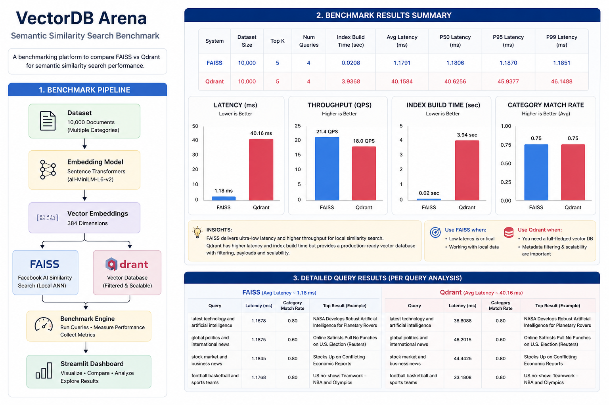

# VectorDB Arena

Semantic similarity search benchmark comparing FAISS and Qdrant.

---

## Overview

VectorDB Arena is an AI engineering project focused on benchmarking semantic similarity search systems using modern embedding models and vector retrieval engines.

The platform evaluates:

* similarity search latency
* throughput (QPS)
* semantic retrieval quality
* index build performance
* ANN retrieval behavior

The benchmark currently compares:

* FAISS
* Qdrant

---

## Architecture

Add your generated architecture image here:

```markdown

```

---

## Project Pipeline

```text
Large Dataset
      ↓
Sentence Transformers
      ↓
Vector Embeddings
      ↓
FAISS / Qdrant
      ↓
Benchmark Engine
      ↓
Performance Metrics
      ↓
Streamlit Dashboard
```

---

## Tech Stack

| Component       | Technology            |
| --------------- | --------------------- |
| Embeddings      | Sentence Transformers |
| Embedding Model | all-MiniLM-L6-v2      |
| Vector Search   | FAISS                 |
| Vector Database | Qdrant                |
| Visualization   | Streamlit             |
| Language        | Python                |
| Data Processing | Pandas / NumPy        |

---

## Benchmark Metrics

The benchmark evaluates:

* Average Latency
* p50 Latency
* p95 Latency
* p99 Latency
* Throughput (QPS)
* Index Build Time
* Semantic Match Rate
* Recall@K

---

## Dataset

Current benchmark dataset:

* AG News Dataset
* 10,000 documents
* Multiple semantic categories

Future plans:

* Wikipedia embeddings
* Enterprise document retrieval
* Larger scale ANN benchmarks

---

## Benchmark Results

### Summary

| System | Avg Latency | Throughput | Match Rate |
| ------ | ----------: | ---------: | ---------: |
| FAISS  |    ~1.18 ms |    ~21 QPS |      ~0.75 |
| Qdrant |      ~40 ms |    ~18 QPS |      ~0.75 |

Key observations:

* FAISS provides extremely fast local similarity search.
* Qdrant introduces higher indexing and retrieval overhead but supports production-oriented vector database capabilities.
* Both systems achieve strong semantic retrieval quality.

---

## Dashboard Features

The Streamlit dashboard visualizes:

* latency comparisons
* throughput metrics
* semantic retrieval quality
* index build performance
* query-level analysis
* benchmark summaries

---

## Folder Structure

```text
vectordb-arena/
│
├── assets/
├── dashboard/
├── data/
├── results/
├── src/
├── README.md
├── requirements.txt
└── .gitignore
```

---

## Run Locally

### 1. Clone repository

```bash
git clone https://github.com/jaweed1988/vectordb-arena.git
cd vectordb-arena
```

### 2. Create virtual environment

```bash
python -m venv venv
```

### 3. Activate environment

Windows:

```bash
venv\Scripts\activate
```

### 4. Install dependencies

```bash
pip install -r requirements.txt
```

### 5. Generate embeddings

```bash
python src/generate_embeddings.py
```

### 6. Run benchmarks

```bash
python src/benchmark_faiss.py
python src/benchmark_qdrant.py
```

### 7. Launch dashboard

```bash
streamlit run dashboard/app.py
```

---

## Future Improvements

* Milvus benchmarking
* Weaviate benchmarking
* GPU acceleration
* distributed ANN retrieval
* larger embedding datasets
* hybrid search benchmarks
* metadata filtering benchmarks

---

## LinkedIn Project Summary

VectorDB Arena is a semantic similarity search benchmark platform designed to evaluate the performance, scalability, and retrieval quality of modern vector retrieval systems.

The project explores AI infrastructure concepts including:

* embeddings
* ANN search
* vector databases
* retrieval performance engineering
* semantic search systems

---

## License

MIT License
